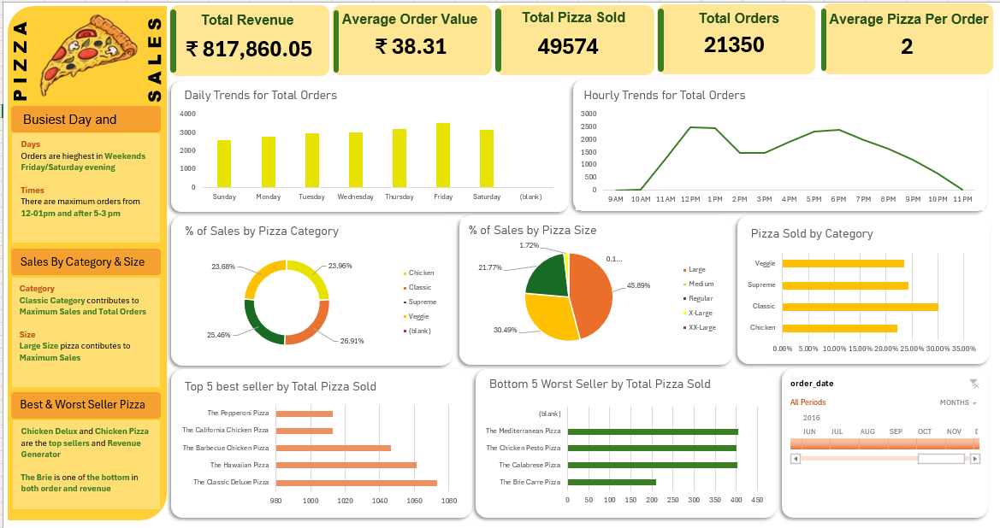

# 🍕 Pizza Sales Dashboard (Excel)

## 📊 Project Overview

This project is an interactive **Excel dashboard** designed to analyze pizza sales data and generate meaningful business insights. It provides a clear understanding of revenue, order patterns, customer behavior, and product performance.

---

## 🎯 Objectives

* Analyze overall sales performance
* Identify peak order times and busiest days
* Understand customer preferences
* Evaluate best and worst-selling pizzas

---

## 📈 Key Insights

* 💰 **Total Revenue:** ₹817,860.05
* 🧾 **Total Orders:** 21,350
* 🍕 **Total Pizzas Sold:** 49,574
* ⏱ **Peak Hours:** 12–1 PM & 5–6 PM
* 📅 **Busiest Days:** Friday & Saturday
* 🏆 **Top Category:** Classic pizzas

---

## 🛠 Tools & Techniques Used

* Microsoft Excel
* Pivot Tables
* Data Cleaning
* Data Visualization
* Interactive Dashboard Design

---

## 📊 Dashboard Features

* Daily order trends
* Hourly sales analysis
* Sales by pizza category and size
* Top 5 best-selling pizzas
* Bottom 5 worst-selling pizzas
* KPI metrics (Revenue, Orders, AOV)

---

## 📷 Dashboard Preview

---

## 📁 Project Files

* `pizza_sales_dashboard.xlsx` → Main Excel dashboard
* `PizzaDashboard.png` → Dashboard preview image

---

## 💡 Learning Outcomes

* Improved Excel dashboarding skills
* Learned data analysis and visualization techniques
* Gained insights into business decision-making

---

## 🔗 Author

**Riya Bhatt**

---
