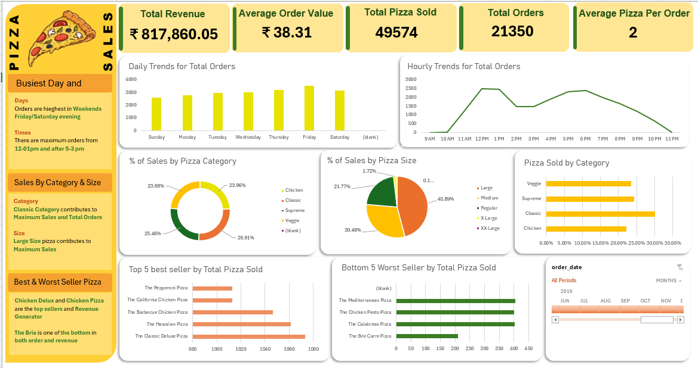

# Pizza Sales Analysis Dashboard

# Project Overview

An interactive Power BI dashboard developed to analyze pizza sales performance, customer ordering behavior, product demand, and revenue trends. The dashboard enables business owners and managers to monitor KPIs, identify best-selling products, optimize inventory, and make data-driven business decisions.

---

# Situation

A pizza restaurant generates thousands of orders every month, making it difficult to manually monitor business performance. Management wanted a centralized dashboard that could answer key business questions such as:

- How much revenue is generated?
- Which pizzas are selling the most?
- Which pizzas are underperforming?
- Which pizza category and size contribute the highest sales?
- What are the busiest days and hours?
- How many pizzas are sold per order?

Without proper reporting, identifying customer buying patterns and improving operational efficiency was challenging.

---

# Task

The objective was to build an interactive Power BI dashboard that could:

- Track overall sales performance.
- Monitor important business KPIs.
- customer purchasing behavior.
- Identify top-performing and low-performing pizzas.
- Understand sales distribution across categories and pizza sizes.
- Discover peak ordering days and hours.
- Help management make data-driven inventory and staffing decisions.

---

# Action
## *Data Preparation*
Imported pizza sales dataset into Power BI.
Performed data cleaning using Power Query.
Removed duplicate records.
Checked for missing values.
Corrected data types.
Created a proper Date column for time-based analysis.

## *Data Modeling*

Created relationships between sales and calendar data for efficient reporting.

## *DAX Measures Created*

Developed custom DAX measures including:

- Total Revenue
- Total Orders
- Total Pizza Sold
- Average Order Value
- Average Pizza Per Order
- Sales Percentage by Category
- Sales Percentage by Size

These measures enabled dynamic calculations across all dashboard visuals.

## *Dashboard Development*

Used a pizza-themed color palette to improve readability and user experience.
Designed an interactive dashboard with slicers and visualizations including:

## *KPI Cards*

Displayed key business metrics:

KPI	Value
- Total Revenue:	₹817,860.05
- Total Orders:	21,350
- Total Pizza Sold:	49,574
- Average Order Value:	₹38.31
- Average Pizza Per Order:	2

## *Sales Trend Analysis*

Created charts to analyze:
- Daily order trends
- Hourly order trends
This helped identify peak business periods.

## *Product Performance Analysis*

Analyzed:
- Sales contribution by pizza category
- Sales contribution by pizza size
- Pizza sold by category
This revealed customer preferences.

## *Best & Worst Seller Analysis*

Created Top 5 and Bottom 5 pizza reports to identify:
- Highest-selling pizzas
- Lowest-selling pizzas
This information can help optimize menu offerings.

## *Interactive Filtering*

Added Date slicer allowing users to:
- Filter reports by month
- Analyze seasonal sales trends
- Compare business performance over time

---

# Result

The dashboard successfully transformed raw sales data into actionable business insights.

Key Insights

📈 Generated ₹817,860.05 in total revenue.

🍕 Sold 49,574 pizzas across 21,350 orders.

💰 Average Order Value reached ₹38.31.

📦 Customers ordered an average of 2 pizzas per order.

📅 Friday recorded the highest number of orders, indicating increased weekend demand.

🕛 Peak ordering hours were between 12 PM–1 PM and 5 PM–7 PM, suggesting optimal staffing periods.

🍕 The Classic Pizza category contributed the highest percentage of sales.

📏 Large-sized pizzas generated the highest share of revenue.

🏆 Chicken Deluxe Pizza and Chicken Pizza emerged as top-selling products.

📉 Brie Pizza and Mediterranean Pizza were among the lowest-selling items, indicating potential candidates for promotional campaigns or menu optimization.

---

# Business Impact

This dashboard helps management:

- Monitor overall business performance in real time.
- Identify high-demand products.
- Reduce inventory waste.
- Improve staffing during peak hours.
- Optimize menu offerings.
- Increase sales through data-driven promotional strategies.
- Support faster and better business decisions.

--- 

# Tools & Technologies

- Power BI
- Power Query
- DAX
- Microsoft Excel
- Data Modeling
- Interactive Dashboard Design

---

# Skills Demonstrated

- Data Cleaning
- Data Transformation
- Data Modeling
- DAX Measure Creation
- Business Intelligence
- Data Visualization
- KPI Design
- Dashboard Development
- Business Insight Generation
- Data Storytelling

---

## 📁 Project Files

* `pizza_sales_dashboard.xlsx` → Main Excel dashboard
* `PizzaDashboard.png` → Dashboard preview image

---

## 🔗 Author

**Riya Bhatt**

---
